# 👒  Commu'nTrip  

---
### 0️⃣ 주제
- #### 관광지 오픈데이터를 이용한 국내 관광지 플랫폼
---
### 📅 기간
- #### 2023.05.17 ~ 2023.05.25 (약 10일)
---
### ❗️ 목적
- #### 오픈 데이터를 이용해 관광지를 검색하고 소통할 수 있는 서비스 구축을 목표.
---
### 👨‍👨‍👧‍👦 참여인원 및 역할
| 이름 | 역할 |
| ---- | ------------- |
| 박대화 | Front-End & Back-End |
| 유혜빈 | Front-End & Back-End |

---
### 📚 목차
#### 1️⃣ 프로젝트 주요기능 
#### 2️⃣ 개발환경 및 문서
#### 3️⃣ 시연 시나리오

---
### 👀 프로젝트 주요기능
- #### 국내 모든 관광지를 검색해볼 수 있으며, 위치, 관관지 맵 등 다양한 상세정보를 열람할 수 있다.
- #### 관광지에 대한 후기나 여러가지 여행 꿀팁을 게시판에서 커뮤니티활동을 할 수 있다.
--- 
### 📝개발환경 및 문서

---
### 👒 시연 시나리오
## 주요기능
### 메인페이지 (index.jsp)

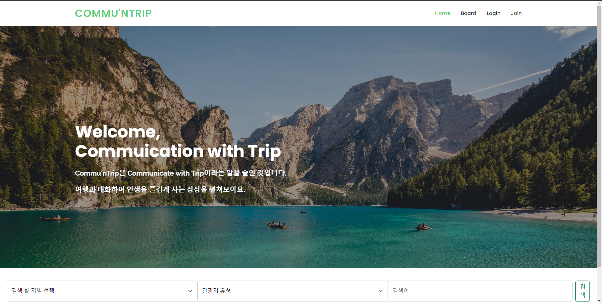

### 회원가입 페이지

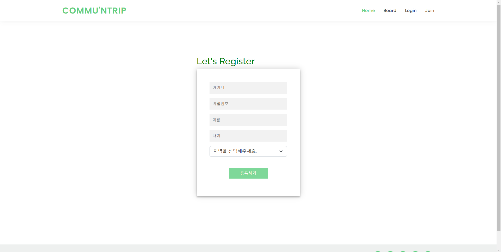

- 회원가입 등록 화면
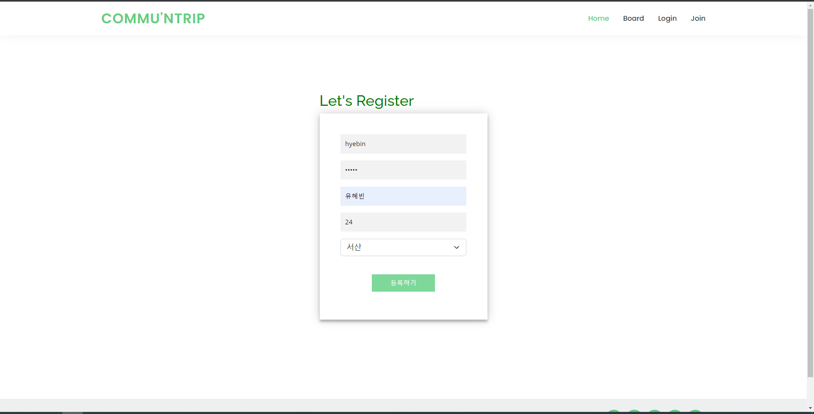

- 회원가입 후  mysql에 insert 됨.
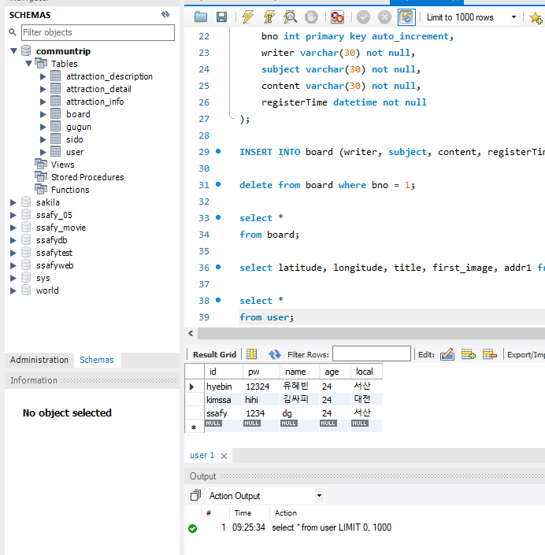

### 로그인 페이지

- 로그인 등록 화면
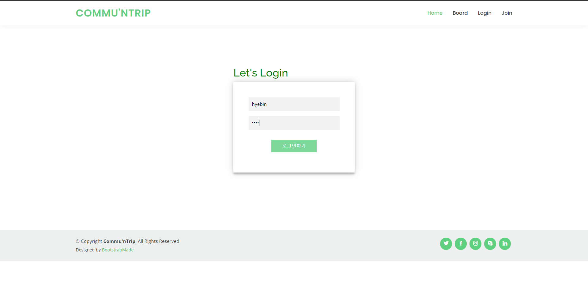

- 로그인 아이디와 비밀번호가 맞지 않을 시 -> 에러페이지로 가짐.

- 로그인 성공시 메인화면으로 가지면서 메뉴바의 구성이 바뀜
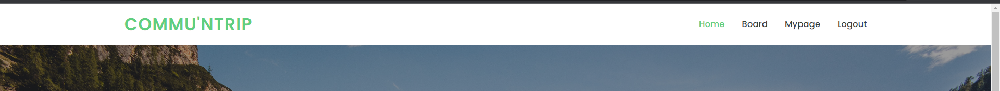

- 로그아웃 클릭시 메뉴바의 구성이 바뀜

### 게시판 페이지
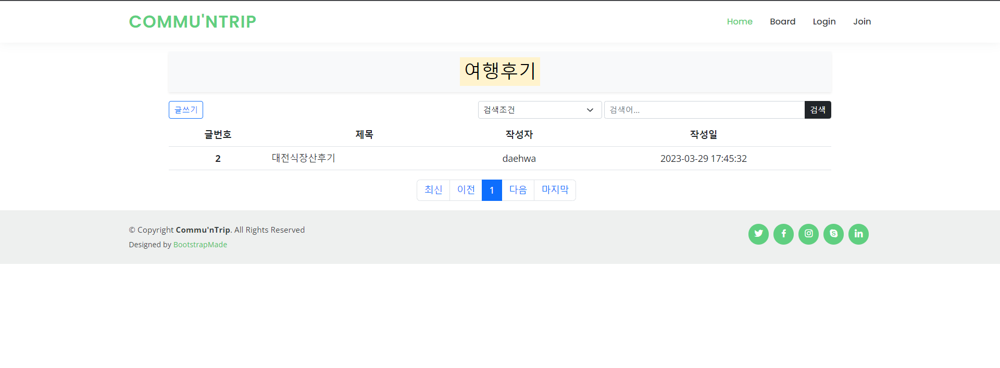

- 여행  후기 글쓰기
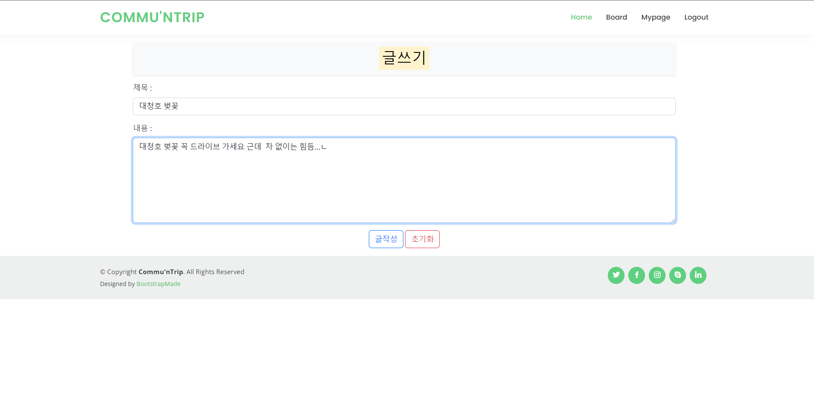

- 여행 작성 완료
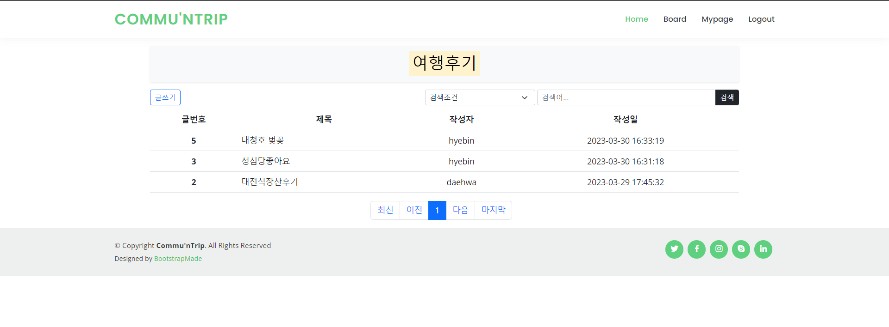

- 여행 후기 삭제
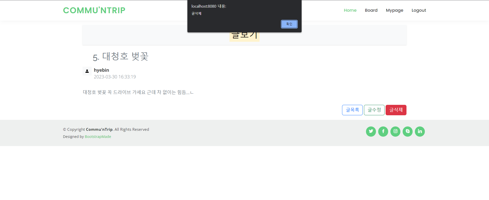

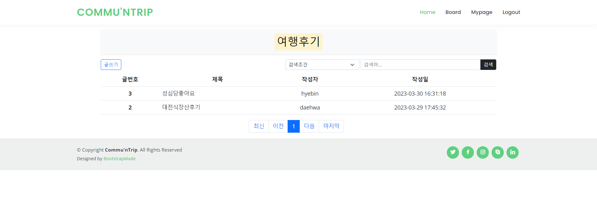

- 여행 후기 수정
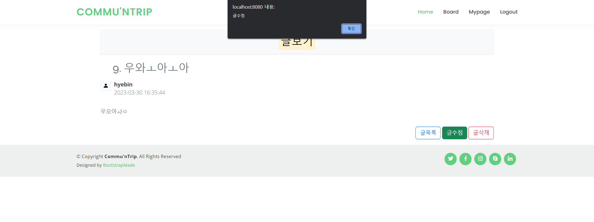
- 수정된 후기

- 다른 사람이 작성한 글은 수정, 삭제 불가
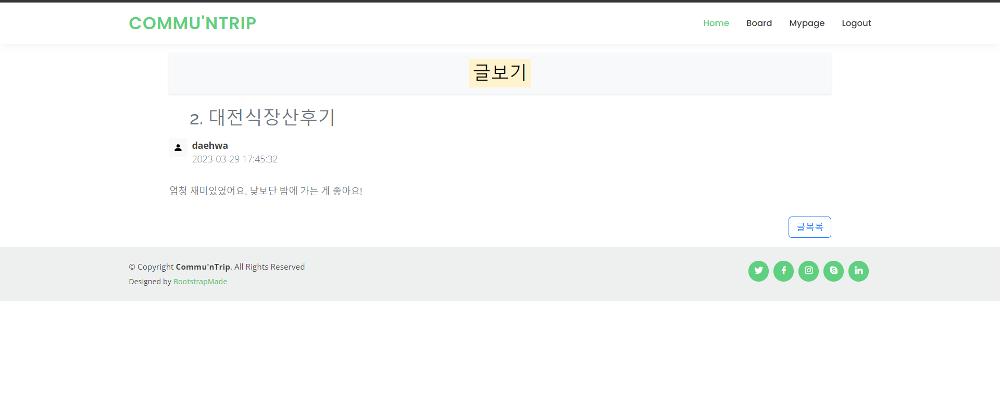

- 페이징 기법
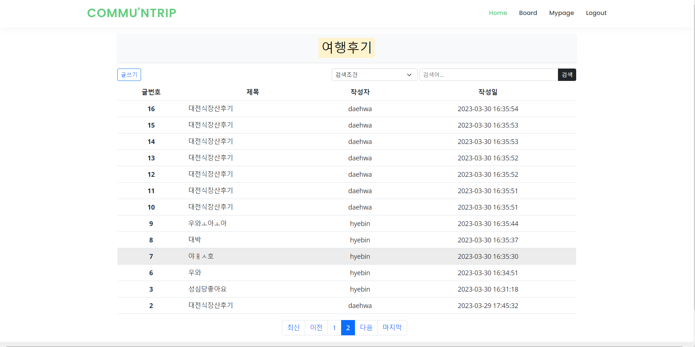
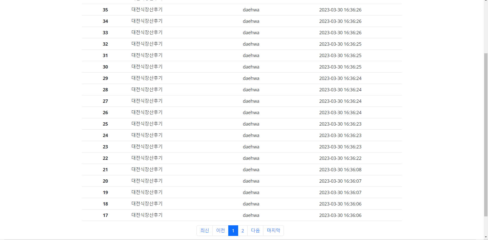

- 조건을 포함해 검색 할 수 있음.
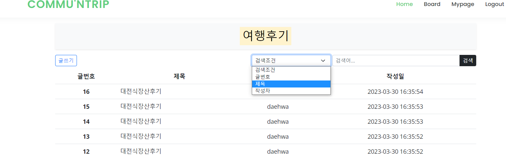
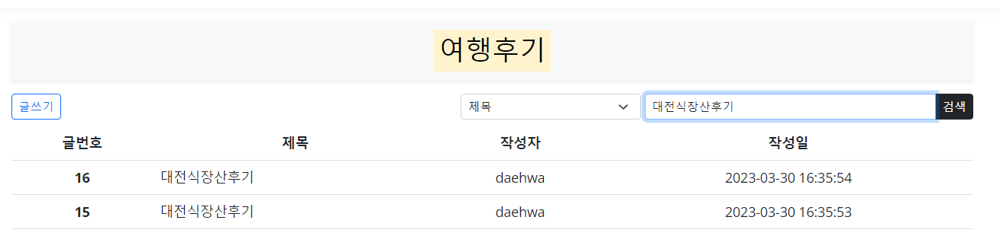
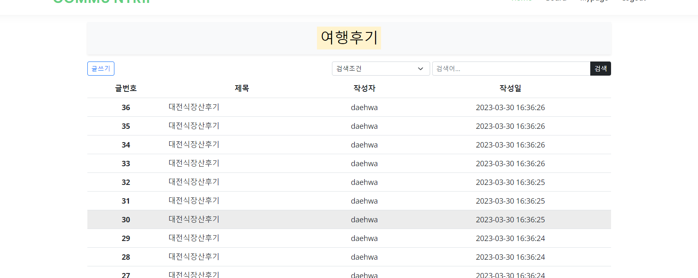

### 마이페이지

- 메인화면
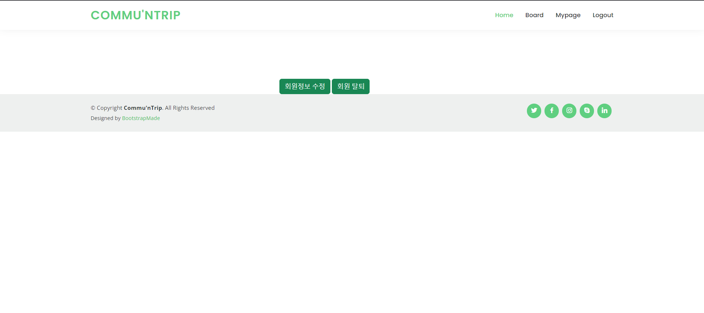

- 내 정보 수정 
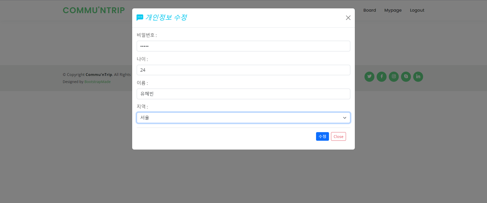

- mysql에서의 update
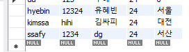

- 회원 탈퇴 mysql
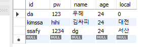

### 관광지 리스트 목록

- 조건을 포함해 검색함.
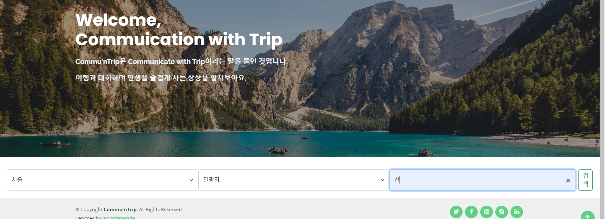

- 검색 눌렀을 시 리스트 목록 출력
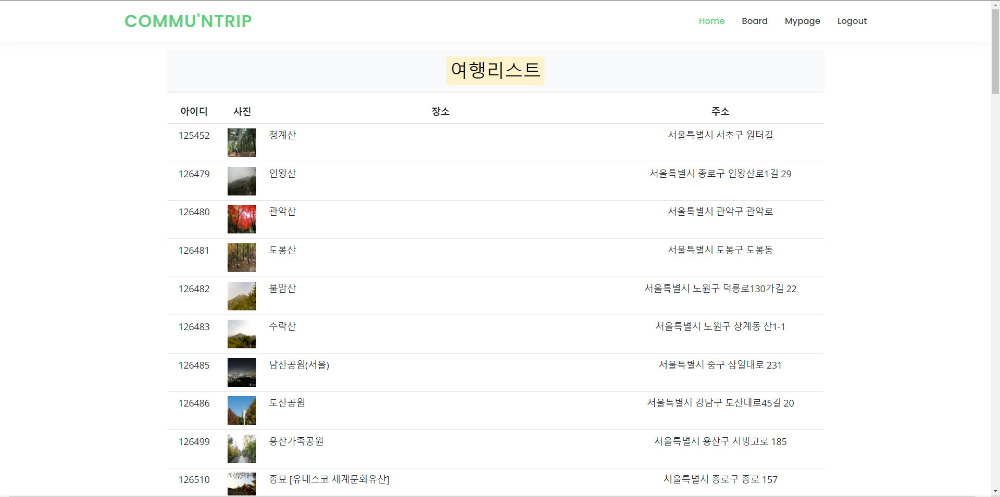

- 리스트 눌렀을 시 상세정보 볼 수 있음 (사진, 정보, 맵)
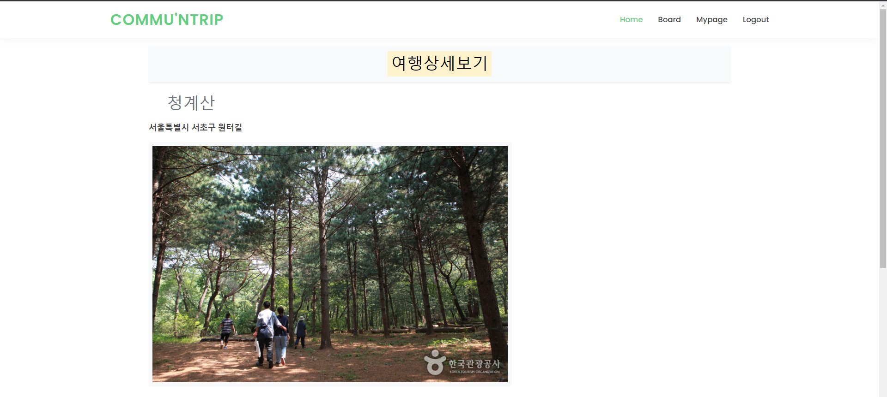
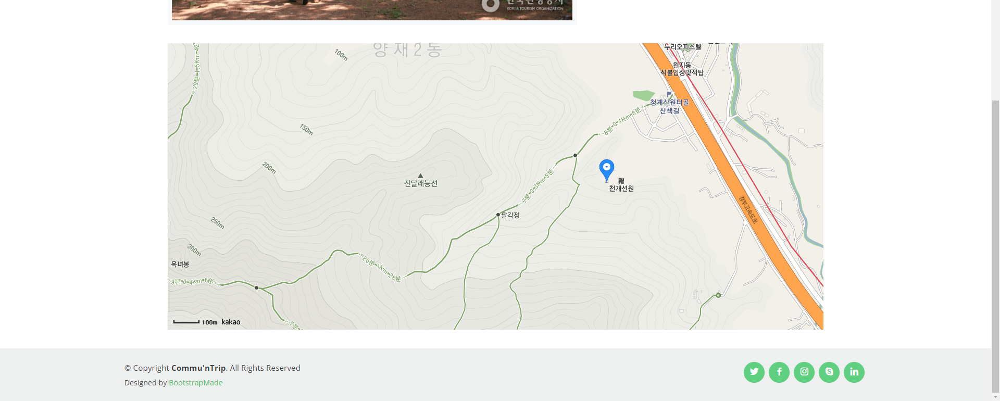

